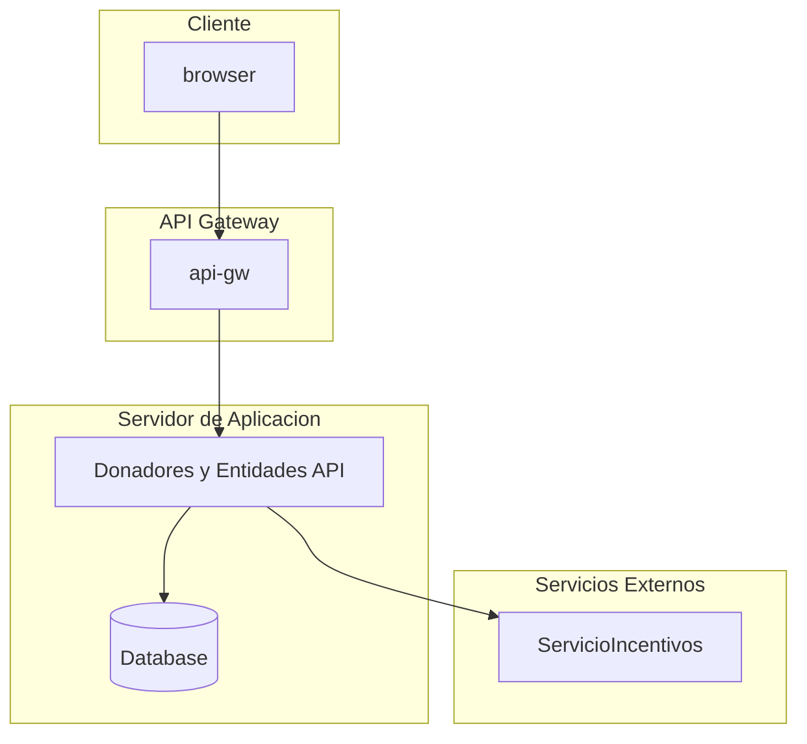
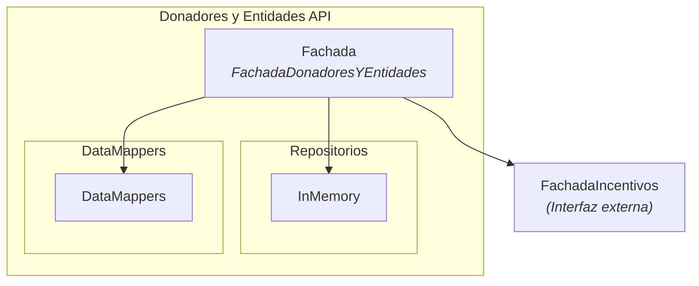

# Arquitectura

## Diagrama de Despliegue

```mermaid
graph TD
    subgraph Cliente
        browser
    end

    subgraph "Servidor de Aplicacion"
        app["Donadores y Entidades API<br/>"]
        db[("Database")]
    end

    subgraph "API Gateway"
        apigw["api-gw"]
    end

    subgraph "Servicios Externos"
        incentivos["ServicioIncentivos"]
    end

    browser --> apigw
    apigw --> app
    app --> db
    app --> incentivos
```

## Diagrama de Componentes

```mermaid
graph TD
    subgraph "Donadores y Entidades API"
        fachada["Fachada<br/><i>FachadaDonadoresYEntidades</i>"]

        subgraph Repositorios
            baseDeDatos["InMemory"]
        end

        subgraph DataMappers
            mappers["DataMappers"]
        end
    end

    incentivos["FachadaIncentivos<br/><i>(Interfaz externa)</i>"]

    fachada --> baseDeDatos
    fachada --> incentivos
    fachada --> mappers
```
