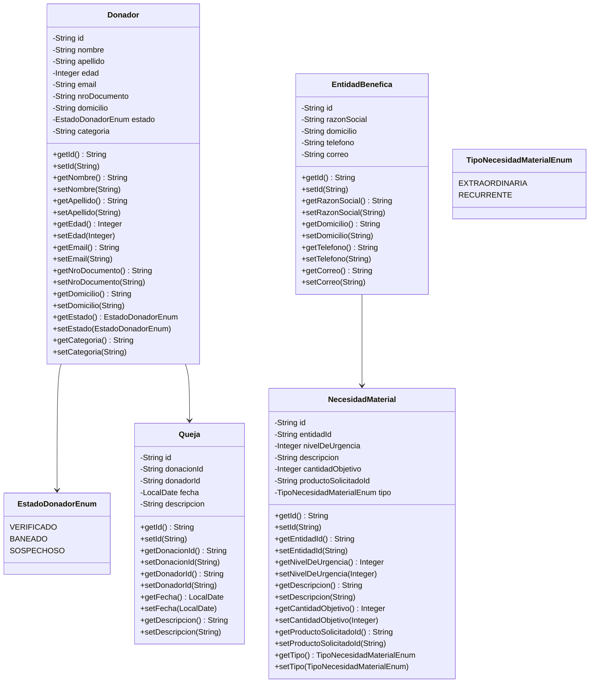

# Modelo del Dominio

## Diagrama de Clases

```mermaid
classDiagram
    class Donador {
        -String id
        -String nombre
        -String apellido
        -Integer edad
        -String email
        -String nroDocumento
        -String domicilio
        -EstadoDonadorEnum estado
        -String categoria
        +getId() String
        +setId(String)
        +getNombre() String
        +setNombre(String)
        +getApellido() String
        +setApellido(String)
        +getEdad() Integer
        +setEdad(Integer)
        +getEmail() String
        +setEmail(String)
        +getNroDocumento() String
        +setNroDocumento(String)
        +getDomicilio() String
        +setDomicilio(String)
        +getEstado() EstadoDonadorEnum
        +setEstado(EstadoDonadorEnum)
        +getCategoria() String
        +setCategoria(String)
    }

    class EntidadBenefica {
        -String id
        -String razonSocial
        -String domicilio
        -String telefono
        -String correo
        +getId() String
        +setId(String)
        +getRazonSocial() String
        +setRazonSocial(String)
        +getDomicilio() String
        +setDomicilio(String)
        +getTelefono() String
        +setTelefono(String)
        +getCorreo() String
        +setCorreo(String)
    }

    class NecesidadMaterial {
        -String id
        -String entidadId
        -Integer nivelDeUrgencia
        -String descripcion
        -Integer cantidadObjetivo
        -String productoSolicitadoId
        -TipoNecesidadMaterialEnum tipo
        +getId() String
        +setId(String)
        +getEntidadId() String
        +setEntidadId(String)
        +getNivelDeUrgencia() Integer
        +setNivelDeUrgencia(Integer)
        +getDescripcion() String
        +setDescripcion(String)
        +getCantidadObjetivo() Integer
        +setCantidadObjetivo(Integer)
        +getProductoSolicitadoId() String
        +setProductoSolicitadoId(String)
        +getTipo() TipoNecesidadMaterialEnum
        +setTipo(TipoNecesidadMaterialEnum)
    }

    class Queja {
        -String id
        -String donacionId
        -String donadorId
        -LocalDate fecha
        -String descripcion
        +getId() String
        +setId(String)
        +getDonacionId() String
        +setDonacionId(String)
        +getDonadorId() String
        +setDonadorId(String)
        +getFecha() LocalDate
        +setFecha(LocalDate)
        +getDescripcion() String
        +setDescripcion(String)
    }

    class EstadoDonadorEnum {
        VERIFICADO
        BANEADO
        SOSPECHOSO
    }
    
    class TipoNecesidadMaterialEnum {
        EXTRAORDINARIA
        RECURRENTE
    }

    Donador --> EstadoDonadorEnum
    Donador --> Queja
    EntidadBenefica --> NecesidadMaterial
```
